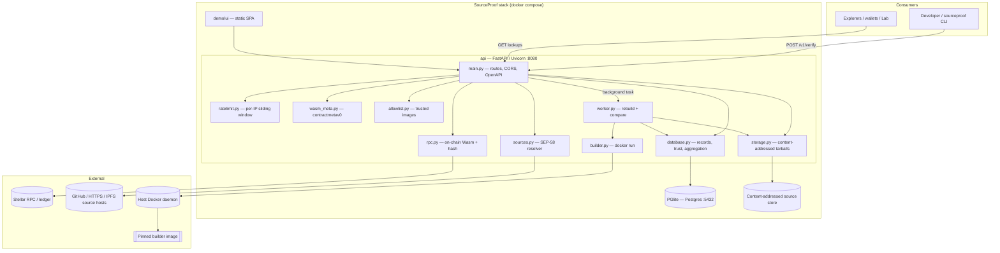
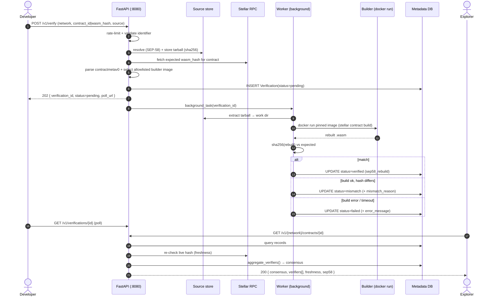

# SourceProof Technical Overview

This document describes the current implementation of the SourceProof (`soroban-verify`) repository: tech stack, local setup, runtime boundaries, and request/data flow.

> **Live hosted instance:** [https://sourceproof.upthrust.club/demo/](https://sourceproof.upthrust.club/demo/) (submit / lookup / registry). Local setup is in [§4](#4-local-setup).

## 1. Purpose

SourceProof is a **contract source verification service** for Stellar/Soroban. It proves that a deployed Wasm contract was built from a specific, publicly inspectable source tree by **rebuilding the submitted source in a pinned environment and comparing the resulting Wasm hash to the bytecode on the ledger**.

The current repo implements:

- a **FastAPI** service that accepts source submissions, rebuilds them, compares hashes, and serves verification lookups
- an in-process **background worker** that runs the rebuild in a pinned Docker builder image and explains mismatches
- a **pinned builder image** (Rust + Stellar CLI) that produces deterministic Wasm
- a **content-addressed source store**, a Postgres-compatible metadata store, a static **demo UI**, and a stdlib-only **developer CLI**

The codebase is intentionally split so that:

- HTTP handling, validation, and aggregation live in the **API layer** (`api/app/main.py`)
- the rebuild/compare job lives in the **worker** (`api/app/worker.py`)
- network reads (chain + source hosts) live in dedicated modules (`rpc.py`, `sources.py`)
- the trust/aggregation model lives in the **data layer** (`api/app/database.py`)

## 2. Tech Stack

### Languages and tooling

| Area | Stack |
|---|---|
| Language | Python 3.11+ (API, worker, tooling) · Rust (contracts, in the builder) |
| API framework | FastAPI + Uvicorn (ASGI) |
| ORM / DB driver | SQLAlchemy 2.0 + `psycopg` (Postgres) / SQLite for tests |
| HTTP client | `httpx` (source fetch, RPC fallback) |
| Stellar | `stellar-sdk` (RPC reads) + `stellar` CLI (build, fetch fallback) |
| Builder runtime | Docker (pinned `rust:1.89-bookworm` + Stellar CLI `23.0.0`) |
| Metadata store (demo) | PGlite (Postgres-compatible, Node) |
| Dev runner | `uvicorn app.main:app --reload` · `docker compose` for the full stack |
| Tests | `pytest` / `pytest-asyncio` |

### API service (`api/`)

| Package | Use |
|---|---|
| `fastapi` | HTTP API + OpenAPI schema |
| `uvicorn[standard]` | ASGI server |
| `python-multipart` | Multipart upload parsing for `POST /v1/verify` |
| `sqlalchemy` | Verification records, trust levels, aggregation |
| `pydantic-settings` | Env-driven configuration (`app/config.py`) |
| `httpx` | Source-host fetch + RPC fallback |
| `stellar-sdk` | Soroban RPC reads (on-chain Wasm + hash) |
| `psycopg[binary]` | Postgres driver |

Pinned versions are in [`../api/requirements.txt`](../api/requirements.txt).

### Builder (`builder/`)

A standalone Docker image used only to rebuild contracts during verification (it is **not** a long-running service). Base `rust:1.89-bookworm`, `wasm32v1-none` target, Stellar CLI installed from a pinned prebuilt release. Entrypoint is [`builder/build.sh`](../builder/build.sh).

### Demo UI (`demo/ui`) and CLI (`cli/`)

- `demo/ui` — static SPA (submit, lookup, consensus, source browser), mounted by the API.
- `cli/sourceproof.py` — stdlib-only developer CLI (`verify` / `status` / `lookup` / `wasm`), a thin reference client over the REST API.

## 3. Repository Structure

```text
soroban-verify/
├── api/
│   ├── app/
│   │   ├── main.py          # FastAPI routes: verify, lookup, source browse, health
│   │   ├── worker.py        # background verifier: extract → build → compare → explain
│   │   ├── builder.py       # docker run pinned builder image; capture build metadata
│   │   ├── sources.py       # SEP-58 source resolver: github / hosted / ipfs / hash-only
│   │   ├── storage.py       # content-addressed tarball store + file listing
│   │   ├── rpc.py           # Stellar RPC / CLI fallback → on-chain Wasm + hash
│   │   ├── wasm_meta.py     # parse contractmetav0 (rsver / rssdkver / bldimg)
│   │   ├── allowlist.py     # digest-pinned trusted builder images
│   │   ├── ratelimit.py     # per-IP sliding-window limiter
│   │   ├── database.py      # models, trust levels, sep58 block, aggregate_verifiers()
│   │   └── config.py        # env-driven settings (RPC, limits, builder image)
│   ├── Dockerfile
│   └── requirements.txt
├── builder/                 # Dockerfile + build.sh (pinned toolchain)
├── cli/
│   └── sourceproof.py       # stdlib-only developer CLI
├── demo/
│   ├── ui/                  # static demo SPA
│   └── pglite/              # Postgres-compatible store (Node)
├── examples/                # demo-contract + verified / mismatch / fail tarballs
├── scripts/                 # start-fast, deploy-contract, build-deploy-verify, gen_architecture
├── docker-compose.yml       # demo stack (api + pglite [+ builder profile])
└── Makefile                 # build / run / demo / builder / test / deploy-contract
```

Important files:

- [api/app/main.py](../api/app/main.py): routes, CORS, OpenAPI, submit + lookup composition
- [api/app/worker.py](../api/app/worker.py): the rebuild/compare job and mismatch explanation
- [api/app/builder.py](../api/app/builder.py): `docker run` invocation of the pinned builder
- [api/app/sources.py](../api/app/sources.py): SEP-58 source normalization to one tarball
- [api/app/database.py](../api/app/database.py): trust levels, `sep58` block, `aggregate_verifiers()`
- [builder/build.sh](../builder/build.sh): the deterministic build entrypoint

## 4. Local Setup

### Requirements

- Docker + Docker Compose (for the full stack and the builder image)
- Python `3.11+` (only for running the API natively or the test suite)
- Stellar CLI (only for the deploy/verify demo scripts)

### Build and run (portable: macOS + Linux/EC2)

```bash
make build      # build the API image + the pinned builder image
make run        # start API + UI on :8080 (auto-detects Docker socket + host data dir)
make ec2        # build + run in one step on a fresh machine
```

Useful alternatives:

```bash
make start          # API + UI + PGlite (skips rebuild if images cached)
make start-fast     # fastest: single API container + SQLite
make builder        # (re)build only the pinned builder image
make deploy-contract  # deploy a contract + package its matching tarball (needs Stellar CLI)
make test           # pytest in api/
make down           # stop the stack
make logs           # tail API logs
```

Run the API natively for development:

```bash
make dev-api        # uvicorn app.main:app --reload --port 8080
```

### Default local ports

| Service | Port | Notes |
|---|---|---|
| API + demo UI | `8080` | FastAPI/Uvicorn; UI mounted at `/demo`, OpenAPI at `/docs` |
| PGlite (metadata) | `5432` | Postgres-compatible store (demo) |

The builder image is build-time only — it is invoked per job via `docker run`, not started as a service.

## 5. Environment Configuration

Configuration is env-driven through `pydantic-settings` ([api/app/config.py](../api/app/config.py)); values may be set via environment or a `.env` file.

| Variable | Default | Purpose |
|---|---|---|
| `API_HOST` / `API_PORT` | `0.0.0.0` / `8080` | API bind address and port |
| `DATABASE_URL` | `postgresql+psycopg://…@pglite:5432/postgres` | Metadata store; use `sqlite:///…` for tests/fast mode |
| `STORAGE_DIR` | `./data/sources` | Content-addressed tarball store root |
| `BUILDER_IMAGE` | `soroban-verify-builder:local` | Pinned builder image used for rebuilds |
| `BUILDER_NETWORK_DISABLED` | `true` | Run builds with `--network none` (demo sets `false` so cargo can fetch crates) |
| `HOST_DATA_DIR` / `CONTAINER_DATA_ROOT` | — / `/app/data` | Docker-out-of-docker path mapping so build work dirs bind-mount correctly |
| `BUILD_TIMEOUT_SECONDS` | `300` | Per-build timeout |
| `MAX_TARBALL_BYTES` | `52428800` (50 MB) | Upload size cap |
| `VERIFY_RATE_LIMIT` / `VERIFY_RATE_WINDOW_SECONDS` | `10` / `60` | Per-IP sliding-window rate limit on writes |
| `VERIFIER_INSTANCE_ID` | `local-verifier-1` | Identity tagged on every record this instance produces |
| `STELLAR_CLI_VERSION` | `23.0.0` | Recorded in build metadata |
| `DOCKER_IMAGE_DIGEST` | `local` | Builder image digest recorded in build metadata |
| `RPC_URL_TESTNET` / `RPC_URL_MAINNET` / `RPC_URL_FUTURENET` | network defaults | Override Soroban RPC base URL per network |

Network passphrases for `testnet` / `mainnet` / `futurenet` are built in.

> Docker-out-of-docker (DooD): when the API runs in a container and shells out to the host Docker daemon, bind-mount paths resolve on the **host**, not inside the API container. `HOST_DATA_DIR` maps `CONTAINER_DATA_ROOT` to the host path so per-build work dirs (under the shared data volume) can be mounted into the builder.

## 6. Architecture

### Component diagram



### Request sequence diagram (verify → lookup)



### API layer (`api/app/main.py`)

A thin composition + transport layer. It validates request shape, enforces the per-IP rate limit on writes, resolves and stores the source, reads the expected hash from RPC, selects the builder image, writes a `pending` record, and schedules the worker. On reads it queries records, re-checks freshness, and calls `aggregate_verifiers()`. It also mounts the demo UI and serves the OpenAPI docs. The API does **not** rebuild inline — verification runs in the background worker.

### Worker (`api/app/worker.py`)

Executes one verification end-to-end: extract the stored tarball to a work dir, invoke the pinned builder via `builder.py`, compute the rebuilt Wasm hash, compare to the expected on-chain hash, and write the terminal status. On a `mismatch` it derives a human-readable `mismatch_reason` from the on-chain `contractmetav0` (toolchain/SDK/image deltas). The work dir is cleaned up after the comparison.

### Builder (`api/app/builder.py` + `builder/`)

Runs `docker run` against the pinned builder image, optionally with `--network none`, with the source bind-mounted read-only and an output dir for the `.wasm`. It captures build metadata (image digest, Stellar CLI and Rust versions, build profile). The image itself ([builder/Dockerfile](../builder/Dockerfile)) pins Rust `1.89-bookworm`, the `wasm32v1-none` target, and Stellar CLI `23.0.0`.

### Source resolver (`api/app/sources.py`)

Normalizes every SEP-58 input mode to a single tarball: `fetch_from_github()` (resolve ref → archive → re-pack), `fetch_hosted_tarball()` (HTTPS / `ipfs://`, hash-verified), and `fetch_content_addressed()` (hash-only). Direct uploads are read straight from the multipart request. External references are provenance only — the stored tarball is the source of truth.

### Data layer (`api/app/database.py`)

Defines the `Verification` model, the `TrustLevel` and `VerificationStatus` enums, the serialized `sep58` block, and `aggregate_verifiers()` — which collapses every verifier's latest record for a contract into one `consensus` (`verified` / `divergent` / `mismatch` / `pending` / `mixed`) plus a per-verifier `signal`.

## 7. External Dependencies and Network Boundaries

### Stellar RPC (`api/app/rpc.py`)

Used to fetch the deployed Wasm bytes + hash for a contract ID, and to re-check the live hash on every lookup (freshness). Endpoints are network-specific and overridable via `RPC_URL_*`. A `stellar contract fetch` CLI fallback covers RPC gaps. RPC failures surface as a graceful error rather than a false status.

### Host Docker daemon (DooD)

The worker shells out to the **host** Docker daemon (socket mounted into the API container) to run the pinned builder. Bind-mount paths are translated from container paths to host paths via `HOST_DATA_DIR` / `CONTAINER_DATA_ROOT` (see §5). The API container holds no build toolchain itself.

### Source hosts (`api/app/sources.py`)

Outbound fetches to GitHub (archive download), arbitrary HTTPS hosts (`tarball_url`), and IPFS gateways (`ipfs://`). All fetched bytes are hash-verified before use; gateways/hosts are untrusted.

## 8. Request and Data Flow

### Primary verify flow

1. Client sends `POST /v1/verify` with `network`, `contract_id` (or `wasm_hash`), and a source (any SEP-58 mode).
2. The API rate-limits the caller, validates the identifier, resolves + stores the source as a content-addressed tarball.
3. The API reads the expected on-chain hash via RPC, parses `contractmetav0`, selects the allowlisted builder image, writes a `pending` record, and returns `202`.
4. The background worker extracts the tarball, rebuilds in the pinned image, and compares hashes → `verified` / `mismatch` / `failed`.
5. The client polls `GET /v1/verifications/{id}`; explorers call `GET /v1/{network}/contracts/{id}`.

### Endpoints (implemented)

| Route | Purpose |
|---|---|
| `POST /v1/verify` | Submit a verification (multipart) → `202` + `verification_id` |
| `GET /v1/verifications` | List recent verifications |
| `GET /v1/verifications/{verification_id}` | Poll one job's status |
| `GET /v1/{network}/contracts/{contract_id}` | **Primary explorer lookup** — aggregated `consensus` + `verifiers[]` + freshness |
| `GET /v1/wasm/{wasm_hash}` | Same shape, keyed by bytecode hash |
| `GET /v1/source/{content_hash}` | Download the stored source tarball |
| `GET /v1/source/{content_hash}/files` | List the tarball's file tree |
| `GET /v1/source/{content_hash}/file` | Preview a single file |
| `GET /health` · `GET /docs` · `GET /redoc` | Health probe · Swagger UI · ReDoc |

## 9. Verification Engine & Status Model

| Status | Meaning |
|---|---|
| `pending` | Queued or building; returned immediately on submit (`202`) |
| `verified` | Rebuilt Wasm hash is byte-identical to the on-chain hash (`trust_level: sep58_rebuild`) |
| `mismatch` | Build succeeded but hashes differ; `mismatch_reason` names the likely cause |
| `failed` | Build error, invalid tarball, timeout, or RPC error (`error_message`) |

Freshness is recomputed on every read by re-fetching the live on-chain hash: `current` (still matches) vs `superseded` (contract upgraded since verification).

## 10. Source Input Resolution (SEP-58)

All input modes normalize to one stored, content-addressed tarball:

| Mode | How it works | Trust note |
|---|---|---|
| `upload` | Multipart `.tar.gz` upload | Most direct; no external dependency |
| `source_repo` (GitHub) | Resolve ref → commit, download archive, re-pack to immutable tarball | Verify the snapshot, not the live repo |
| `tarball_url` (HTTPS) | Fetch + verify `tarball_sha256` | Host untrusted; hash pins bytes |
| `ipfs://` | Multi-gateway fetch + verify hash | Gateways untrusted; hash pins bytes |
| `tarball_sha256` (hash-only) | Reuse an already-stored tarball by hash | Source must already be in the store |

## 11. Deterministic Build Environment

Reproducibility is the basis of trust:

- Builder image pinned (Rust `1.89-bookworm`, Stellar CLI `23.0.0`, `wasm32v1-none`); recorded as a digest in build metadata.
- `stellar contract build` produces a release Wasm by default.
- `Cargo.lock` travels in the tarball; [builder/build.sh](../builder/build.sh) copies the source to a writable work dir before building and emits the resolved `Cargo.lock`.
- Build metadata captures `docker_image_digest`, `stellar_cli_version`, `rustc_version`, and `build_profile`. Capturing the resolved `soroban-sdk` version (from the emitted `Cargo.lock`) is on the roadmap.
- Reproducibility is validated by building the same tarball twice in the pinned image and confirming identical Wasm hashes.

## 12. Trust Levels & Multi-Verifier Aggregation

| Trust level | Proves | Strength |
|---|---|---|
| `sep58_rebuild` | Rebuilt Wasm byte-identical to on-chain Wasm in an allowlisted image | Strong |
| `sep55_attestation` | A SEP-55 build workflow ran at a commit (ingestion is roadmap) | Weak (provenance) |
| `unverified` | Nothing | Default |

`aggregate_verifiers()` returns a `consensus` plus one attributable signal per verifier — never a single forced verdict. Cross-operator federation (registration + ed25519-signed results) is the roadmap layer on top of this same shape.

## 13. Security & Isolation

- **Build isolation:** one ephemeral container per job; `--network none` in production (`BUILDER_NETWORK_DISABLED=true`); per-build timeout; work dir destroyed after compare.
- **Tarball safety:** size cap (`MAX_TARBALL_BYTES`), safe unpack (no path traversal), content-addressed storage (tamper-evident; the hash is in the URL).
- **Abuse protection:** per-IP sliding-window rate limit on writes (`429` + `Retry-After`). No API keys / KYC — this is a public good; abuse resistance is the control, not gated access.
- **No secret exposure:** submitted code runs without host secrets; the API does not custody keys or deploy contracts.

## 14. Current Limitations

The repo is a working prototype, not yet the production service. The main gaps (tracked in the roadmap):

- single in-process worker (no distributed job queue / horizontal autoscaling yet)
- multi-verifier **federation** (registration + signed results) is designed but not wired — aggregation is implemented for a single instance
- `sep55_attestation` ingestion, contract-interface/bindings endpoints, status badge, shared-Wasm coverage, IPFS pinning, and the trusted-interaction UI are roadmap
- the demo stack relaxes build network isolation (`BUILDER_NETWORK_DISABLED=false`) so cargo can fetch crates; production runs `--network none`

## 15. Development Notes

When extending the codebase, keep these boundaries intact:

- add HTTP routes, validation, and aggregation in `api/app/main.py`
- keep the rebuild/compare job and mismatch explanation in `api/app/worker.py`
- isolate chain reads in `api/app/rpc.py` and source fetches in `api/app/sources.py`
- keep trust levels, the `sep58` block, and `aggregate_verifiers()` in `api/app/database.py`
- never run inline builds in the request path — submit returns `202` and the worker does the work

This separation matches the current implementation and the diagrams above, and is the cleanest path for future additions (distributed queue, federation, interface/bindings endpoints, and the interaction UI).
